# NL2SQL Demo Architecture Analysis

## Diagram Index

| Diagram Name | Type | Primary Files/Evidence |
|---|---|---|
| System Context | flowchart | app.py, nl2sql/llm_engine.py, nl2sql/engine.py, nl2sql/db.py, README.md |
| Container View | flowchart | app.py, nl2sql/db.py, nl2sql/schema.py, nl2sql/eval.py, data/* |
| Package Dependency | flowchart | app.py, nl2sql/*.py, tests/* |
| Component View | flowchart | app.py, nl2sql/engine.py, nl2sql/llm_engine.py, nl2sql/db.py, nl2sql/eval.py, nl2sql/schema.py |
| Sequence 1: LLM Query Flow | sequenceDiagram | app.py, nl2sql/llm_engine.py, nl2sql/db.py |
| Sequence 2: Rule-Based Query Flow | sequenceDiagram | app.py, nl2sql/engine.py, nl2sql/db.py, nl2sql/schema.py |
| Sequence 3: Golden Evaluation Flow | sequenceDiagram | app.py, nl2sql/eval.py, nl2sql/engine.py, data/golden/golden.sql.jsonl |
| Activity: Rule Translation Pipeline | flowchart | nl2sql/engine.py |
| Activity: DB Bootstrap and Seeding | flowchart | nl2sql/db.py, data/seed/*, nl2sql/schema.py |
| Domain and Schema Classes | classDiagram | nl2sql/schema.py, nl2sql/eval.py |
| Data Flow | flowchart | app.py, generate_seed_data.py, nl2sql/db.py, nl2sql/eval.py, data/* |
| Local Deployment Topology | flowchart | README.md, app.py, .streamlit/config.toml, requirements.txt |
| AuthN/AuthZ Flow (AAD) | sequenceDiagram | nl2sql/llm_engine.py, README.md, requirements.txt |
| Trust Boundaries | flowchart | app.py, nl2sql/llm_engine.py, nl2sql/db.py, .env.example |
| CI/CD Pipeline | N/A | No CI pipeline files found |
| Observability Topology | N/A | No logging/metrics/tracing stack found |
| Zoom-In: Evaluation Comparison Internals | flowchart | nl2sql/eval.py |

## Evidence Map

### 1) Repo purpose summary (from docs and entrypoints)
- The repository is a demo NL2SQL application with Streamlit UI, rule-based fallback translation, optional Azure OpenAI translation, and golden-set evaluation.
- Evidence: README.md, app.py, nl2sql/eval.py.

### 2) Entrypoints identified
- Streamlit web app entrypoint: app.py.
- Seed data generation script: generate_seed_data.py.
- Optional AAD API demo script: nl2sql/demo_aad.py.

### 3) Core layers identified
- UI / orchestration: app.py.
- Translation services:
	- Rule engine: nl2sql/engine.py.
	- LLM engine: nl2sql/llm_engine.py.
- Persistence and execution: nl2sql/db.py.
- Schema/domain metadata: nl2sql/schema.py.
- Evaluation pipeline: nl2sql/eval.py.

### 4) Dependencies identified
- Internal imports tie UI -> translators/db/eval and services -> schema/db.
- External runtime dependencies: streamlit, pandas, openai, azure-identity, python-dotenv.
- External systems: Azure OpenAI and Microsoft Entra ID for AAD token flow.
- Evidence: requirements.txt, nl2sql/llm_engine.py, app.py.

### 5) Data models identified
- In-code dataclasses:
	- ColumnDef, TableDef, JoinRelation in nl2sql/schema.py.
	- CaseResult, EvalReport in nl2sql/eval.py.
- Persistence artifacts:
	- Schema source CSV: data/snowflake_table_columns.csv.
	- Seed CSVs: data/seed/*.csv.
	- SQLite DB: data/demo.sqlite.
	- Golden dataset: data/golden/golden.sql.jsonl.

---

## A) High-Level Architecture

### A1) System Context

Why it exists:
- Answers what users and external systems interact with this app.

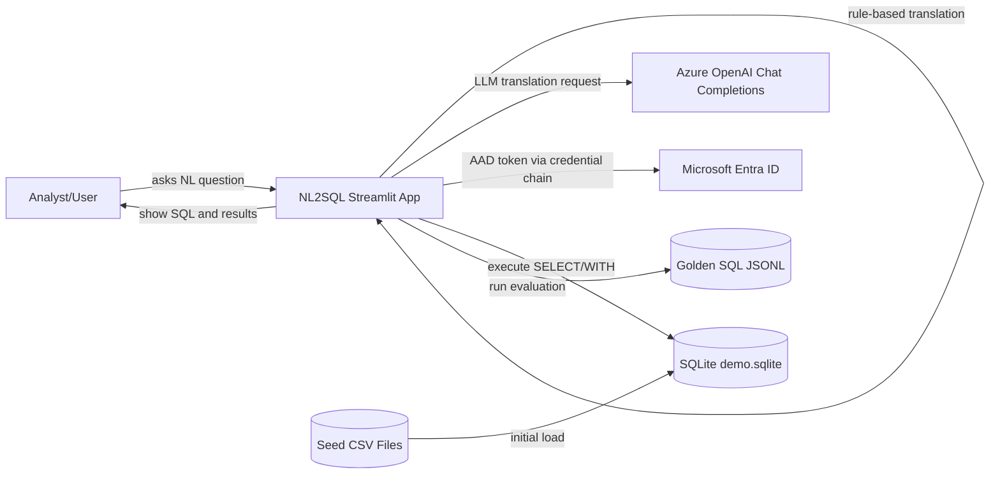

Notes + assumptions:
- Single Streamlit process hosts UI and orchestration.
- Rule-based translation can operate without cloud services.

Pointers:
- app.py
- nl2sql/llm_engine.py
- nl2sql/db.py
- nl2sql/eval.py

### A2) Container Diagram

Why it exists:
- Answers how responsibilities are split into major executable/logical containers.

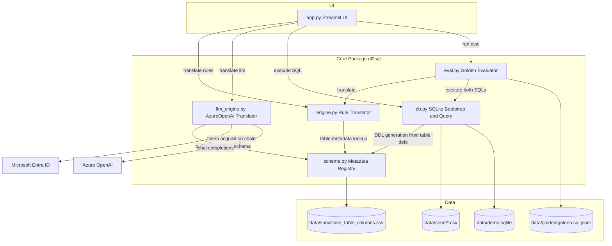

Notes + assumptions:
- Evaluator currently uses rule translator only.

Pointers:
- app.py
- nl2sql/eval.py
- nl2sql/schema.py
- nl2sql/db.py

---

## B) Code and Module Structure

### B1) Package/Module Dependency Diagram

Why it exists:
- Answers how code-level dependencies flow across modules.

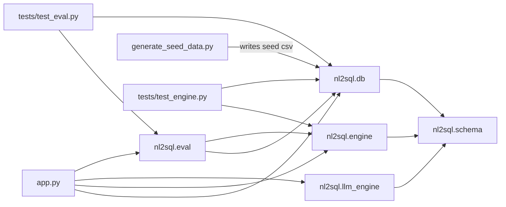

Notes + assumptions:
- Based strictly on imports and direct call paths.

Pointers:
- app.py
- nl2sql/*.py
- tests/*.py

### B2) Component Diagram

Why it exists:
- Answers which internal functions/components collaborate at runtime.

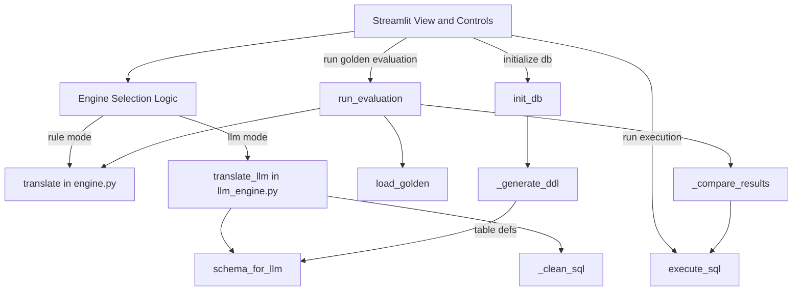

Notes + assumptions:
- SchemaText node represents prompt-text generation and schema metadata use.

Pointers:
- app.py
- nl2sql/engine.py
- nl2sql/llm_engine.py
- nl2sql/db.py
- nl2sql/eval.py
- nl2sql/schema.py

---

## C) Runtime Behavior

### C1) Sequence: LLM Query Flow

Why it exists:
- Answers the end-to-end request lifecycle for LLM mode.

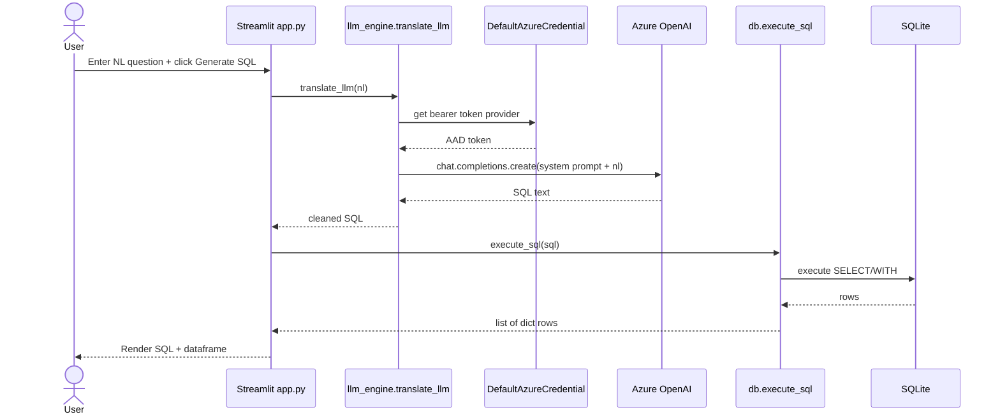

Notes + assumptions:
- Missing env vars or failed AAD auth exits via exception path in app.py.

Pointers:
- app.py
- nl2sql/llm_engine.py
- nl2sql/db.py

### C2) Sequence: Rule-Based Query Flow

Why it exists:
- Answers deterministic fallback behavior when LLM is not used.

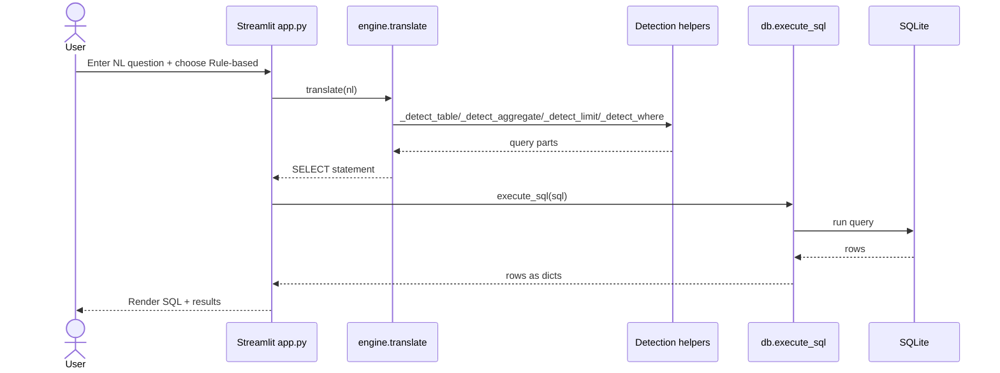

Notes + assumptions:
- Rule engine handles a narrow pattern subset.

Pointers:
- app.py
- nl2sql/engine.py
- nl2sql/db.py

### C3) Sequence: Golden Evaluation Flow

Why it exists:
- Answers how evaluation metrics and mismatches are computed.

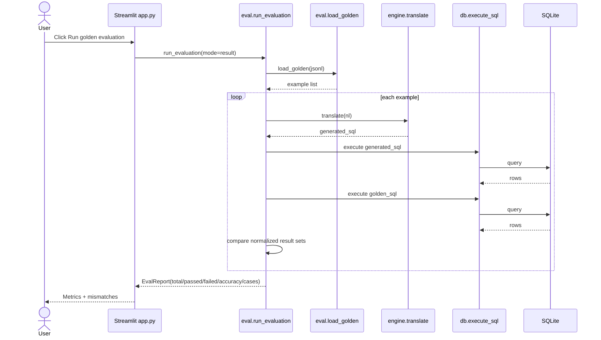

Notes + assumptions:
- Result mode ignores column alias names and compares values.

Pointers:
- app.py
- nl2sql/eval.py
- nl2sql/engine.py

### C4) Activity: Rule Translation Pipeline

Why it exists:
- Answers decision ordering in the fallback translator.

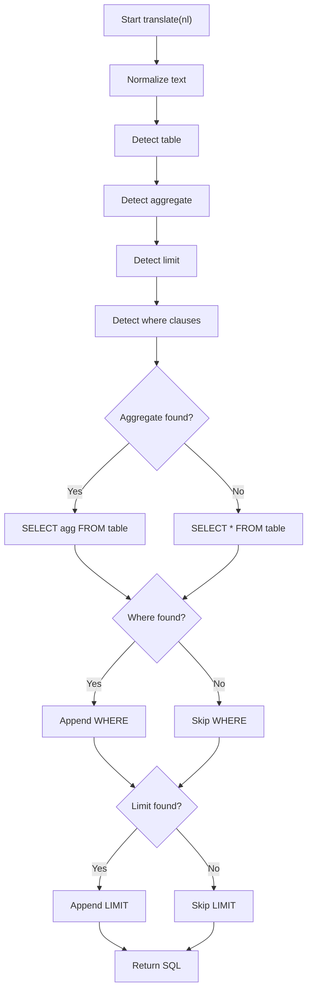

Notes + assumptions:
- Detection helpers are sequential and not confidence-scored.

Pointers:
- nl2sql/engine.py

### C5) Activity: DB Bootstrap and Seeding

Why it exists:
- Answers the create/recreate lifecycle of the local SQLite store.

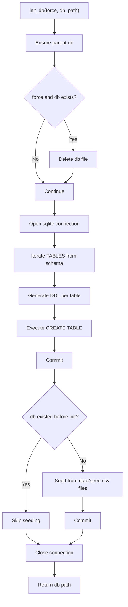

Notes + assumptions:
- Missing CSV for a table is skipped silently.

Pointers:
- nl2sql/db.py
- nl2sql/schema.py
- data/seed/*

---

## D) Data and Schemas

### D1) ER/Class Diagram for Core Models

Why it exists:
- Answers how schema metadata and evaluation objects are represented.

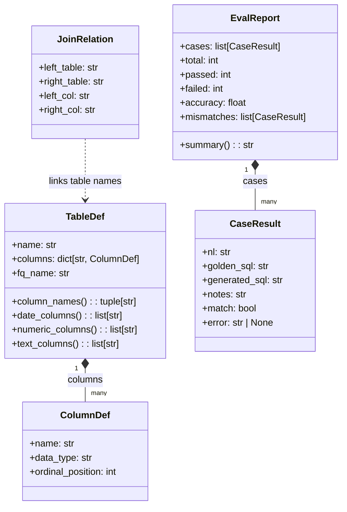

Notes + assumptions:
- No ORM entities were found; schema is metadata-driven.

Pointers:
- nl2sql/schema.py
- nl2sql/eval.py

### D2) Data Flow Diagram

Why it exists:
- Answers where data comes from, how it is transformed, and where it lands.

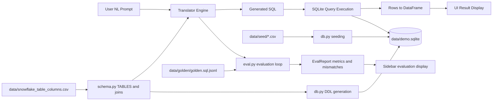

Notes + assumptions:
- Evaluator currently invokes rule engine translation.

Pointers:
- app.py
- nl2sql/schema.py
- nl2sql/db.py
- nl2sql/eval.py
- data/*

---

## E) Ops and Delivery

### E1) Deployment Diagram (Local)

Why it exists:
- Answers how the repository currently runs in practice.

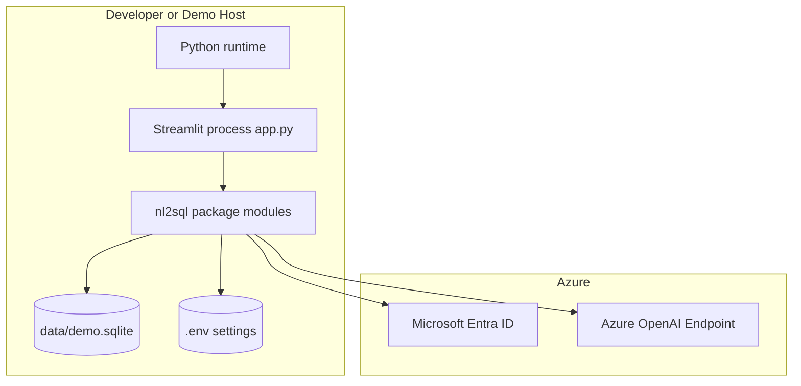

Notes + assumptions:
- No Docker/Kubernetes/IaC pipeline files were found.

Pointers:
- README.md
- app.py
- .streamlit/config.toml
- requirements.txt

### E2) CI/CD Pipeline Diagram

Why it exists:
- Would answer how code moves through automated build/test/deploy.

Not applicable:
- No CI/CD configuration files are present in the repository.
- Only local testing instructions and pytest suites were found.

Pointers:
- README.md
- tests/test_engine.py
- tests/test_eval.py

### E3) Observability Diagram

Why it exists:
- Would answer how logs/metrics/traces and alerts propagate.

Not applicable:
- No observability stack, tracing SDK, metrics exporter, or alerting config was found.

Pointers:
- app.py
- nl2sql/*.py
- requirements.txt

---

## F) Security

### F1) AuthN/AuthZ Flow (AAD)

Why it exists:
- Answers token issuance and authorization path for Azure OpenAI access.

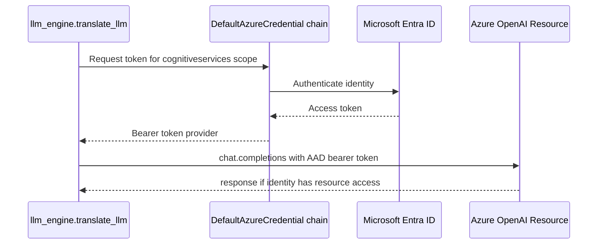

Notes + assumptions:
- App-level user authentication is not implemented.
- Access control is enforced at Azure resource/identity policy layer.

Pointers:
- nl2sql/llm_engine.py
- README.md

### F2) Trust Boundaries Diagram

Why it exists:
- Answers where untrusted input enters and where sensitive trust boundaries exist.

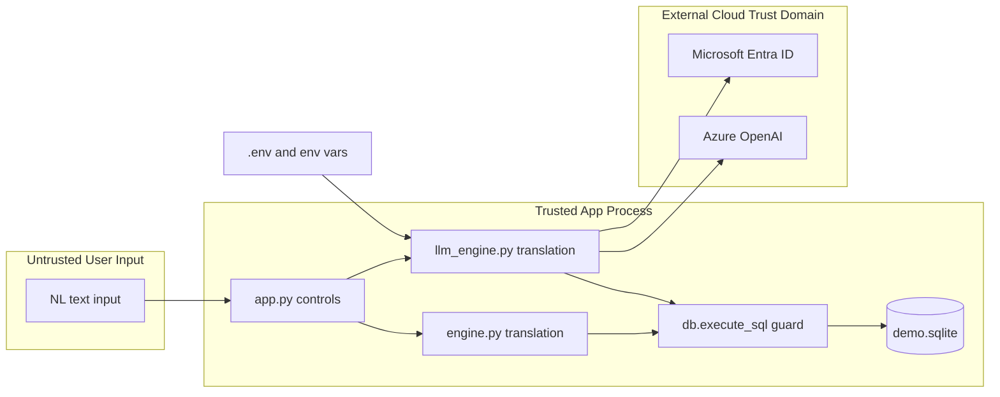

Notes + assumptions:
- db.execute_sql enforces SELECT/WITH-only statement restriction.

Pointers:
- app.py
- nl2sql/db.py
- nl2sql/llm_engine.py
- .env.example

---

## Zoom-In Diagram

### Z1) Evaluation Comparison Internals

Why it exists:
- Answers how mode-specific comparison (string vs result) works and where mismatches are emitted.

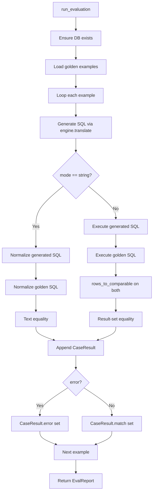

Notes + assumptions:
- _rows_to_comparable intentionally ignores alias names by comparing value tuples.

Pointers:
- nl2sql/eval.py

---

## Omitted As Not Applicable (with rationale)

- Background workers/schedulers diagram: no worker framework or scheduler files found.
- API route diagram: no FastAPI/Flask/Django route layer present; UI is Streamlit-based.
- Queue/event-bus diagram: no queue/broker dependencies in requirements or code.
- Multi-environment cloud deployment diagram: no IaC or deployment manifests found.

## Uncertainty Notes

- README still contains one historical phrase referencing OpenAI in a limitations paragraph, but operational code uses Azure OpenAI + AAD in llm_engine.py.
- nl2sql/demo_aad.py appears to be an auxiliary experiment script and is not imported by app.py.
